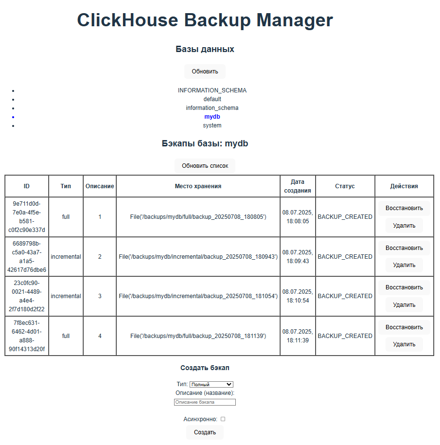

# ClickHouse Backup Manager

## Описание

**ClickHouse Backup Manager** — комплексное решение для управления резервным копированием и восстановлением баз данных ClickHouse с использованием нативных команд `BACKUP` и `RESTORE`.  
Проект обеспечивает:
- Безопасное создание и восстановление бэкапов
- Защиту от SQL-инъекций и несанкционированного доступа
- Простое управление через веб-интерфейс

Компоненты:
- **Backend** на FastAPI с защитой от инъекций
- **Frontend** на Vue.js 3 с валидацией ввода
- **ClickHouse** с безопасной конфигурацией

Поддерживает полные и инкрементные бэкапы с проверкой зависимостей.

---

## Содержание
- [Ключевые особенности](#ключевые-особенности)  
- [Требования](#требования)  
- [Безопасность](#безопасность)
- [Установка и запуск](#установка-и-запуск)  
- [Использование API](#использование-api)  
- [Пользовательский интерфейс](#пользовательский-интерфейс)  
- [Структура проекта](#структура-проекта)  
- [Версионирование](#версионирование)  
- [Планы по развитию](#планы-по-развитию)  
- [Лицензия](#лицензия)

---

## Ключевые особенности
- **Безопасность:**
  - Защита от SQL-инъекций через строгую валидацию
  - Экранирование идентификаторов в DDL-операциях
  - Ограниченные права пользователя ClickHouse
- **Нативные операции:**
  - Использование команд `BACKUP` и `RESTORE` (ClickHouse ≥ 23.3)
  - Поддержка полных и инкрементных бэкапов
- **Управление зависимостями:**
  - Контроль цепочки бэкапов
  - Защита от удаления базовых бэкапов
- **Архитектура:**
  - REST API на FastAPI с CORS
  - SPA-фронтенд на Vue.js 3
  - Контейнеризация через Docker Compose
- **Метаданные:**
  - Хранение в изолированном JSON-файле
  - Отдельно от основных баз данных

---

## Требования
- **ClickHouse**: 25.5.5.19+ (используется в docker-compose)
- **Python**: 3.10+
- **Node.js**: 18+
- **Docker**: 20.10+
- **Docker Compose**: 2.0+

---

## Безопасность
Система включает многоуровневую защиту:
1. **Валидация ввода:**
   - Проверка идентификаторов через regex `^[a-zA-Z_][a-zA-Z0-9_]*$`
   - Ограничение длины имен (128 символов)
2. **Защита от SQL-инъекций:**
   - Параметризованные запросы
   - Экранирование идентификаторов
3. **Безопасная конфигурация:**
   - Изолированный пользователь ClickHouse с минимальными правами
   - Ограничение путей для бэкапов
4. **Контроль зависимостей:**
   - Запрет удаления базовых бэкапов
   - Проверка целостности цепочки

---

## Установка и запуск

### 1. Клонирование репозитория
```bash
git clone https://github.com/FfxlJjS1/ClickHouseWebBackupManager.git
cd ClickHouseWebBackupManager
```

### 2. Запуск через Docker Compose (рекомендуется)
```bash
docker-compose up --build
```

Сервисы будут доступны:
- Frontend: http://localhost:80
- ClickHouse: http://localhost:9000

---

## Пользовательский интерфейс
Интерфейс предоставляет:
1. **Управление базами данных:**
   - Просмотр списка баз
   - Выбор активной базы
2. **Работа с бэкапами:**
   - Создание полных/инкрементных бэкапов
   - Восстановление из бэкапа
   - Удаление с проверкой зависимостей
3. **Мониторинг:**
   - Статус операций
   - Детали ошибок
   - История операций



---

## Структура проекта
```
clickhouse-backup-manager/
├── backend/                 # FastAPI backend
│   ├── main.py              # Основной API
│   ├── worker.py            # Логика работы с ClickHouse
│   ├── validation.py        # Валидация ввода
│   ├── environments.py      # Конфигурация окружения
│   ├── logger.py            # Система логирования
│   ├── requirements.txt     # Зависимости Python
│   └── Dockerfile
├── frontend/                # Vue.js frontend
│   ├── src/
│   │   ├── App.vue          # Основной компонент
│   │   └── main.js          # Точка входа
│   ├── package.json
│   └── Dockerfile
├── docker-compose.yml       # Конфигурация Docker
├── backup_disk.xml          # Конфиг ClickHouse для бэкапов
└── README.md                # Документация
```
